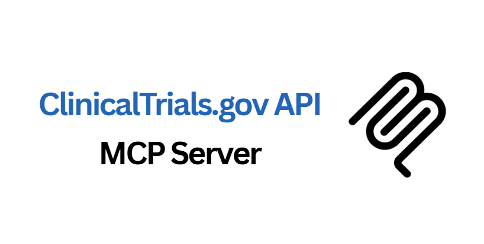

# Clinical Trials MCP Server

A comprehensive Model Context Protocol (MCP) server that provides access to the ClinicalTrials.gov API, enabling researchers, clinicians, and developers to access real-time clinical trial data programmatically.

**Developed by [Augmented Nature](https://augmentednature.ai)**

## Overview

The Clinical Trials MCP server exposes the full ClinicalTrials.gov API v2.0.4 functionality through 18 specialized MCP tools, allowing you to search, analyze, and retrieve detailed information about clinical trials worldwide directly from your MCP-enabled environment.

## Features

### Core Search Tools
- **search_studies** - General search with comprehensive filters (condition, intervention, location, phase, status, age, sex)
- **get_study_details** - Detailed study information by NCT ID with complete metadata
- **search_by_condition** - Condition-focused search with eligibility criteria
- **search_by_location** - Geographic-based search with distance radius filtering
- **search_by_sponsor** - Organization and sponsor-based search with sponsor type filtering
- **search_by_intervention** - Treatment, drug, and intervention-focused search

### Specialized Search Tools
- **get_recruiting_studies** - Currently recruiting trials with active contact information
- **search_by_date_range** - Temporal search by study start and completion dates
- **get_studies_with_results** - Completed trials with published results
- **search_rare_diseases** - Specialized search for rare diseases and orphan conditions
- **get_pediatric_studies** - Pediatric-specific trials for children and adolescents
- **search_international_studies** - Multi-country international trials

### Advanced Analysis Tools
- **get_similar_studies** - Find studies similar to a reference NCT ID by condition, sponsor, or phase
- **search_by_primary_outcome** - Search by primary outcome measures and endpoints
- **search_by_eligibility_criteria** - Advanced eligibility filtering with inclusion/exclusion keywords
- **get_study_timeline** - Timeline analysis with current, completed, and upcoming studies
- **get_trial_statistics** - Aggregate statistics and analytics with grouping capabilities

### Data Quality Features
- Real-time data access (updated daily Monday-Friday)
- NCT ID validation with regex patterns
- Comprehensive JSON Schema validation
- Geographic coordinate data for study locations
- Contact information for recruiting studies
- Robust error handling and timeout protection

## Installation

### Prerequisites
- Node.js 16+ (install from [nodejs.org](https://nodejs.org))
- No API key required (ClinicalTrials.gov API is publicly accessible)

### Setup Steps

1. **Navigate to your MCP directory**:
   ```bash
   cd ~/Documents/Claude/MCP  # or your preferred MCP directory
   ```

2. **The server is already built and configured**:
   ```bash
   ls clinical-trials-server/
   # Should show: build/ src/ package.json tsconfig.json README.md
   ```

3. **Verify build**:
   ```bash
   cd clinical-trials-server
   ls build/
   # Should show: index.js (executable)
   ```

## Configuration

Add this to your claude_desktop_config.json:
- macOS: `~/Library/Application Support/Claude/claude_desktop_config.json`
- Windows: `%APPDATA%/Claude/claude_desktop_config.json`

```json
{
  "mcpServers": {
    "clinical-trials": {
      "command": "node",
      "args": ["path/to/clinical-trials-server/build/index.js"],
      "autoApprove": [
        "search_studies",
        "get_study_details", 
        "search_by_condition",
        "search_by_location",
        "get_recruiting_studies",
        "search_by_sponsor",
        "search_by_intervention",
        "get_trial_statistics"
      ]
    }
  }
}
```

**Note**: Replace `path/to/clinical-trials-server` with the absolute path to your server directory.

## Usage Examples

### Search for Cancer Trials
```json
{
  "condition": "cancer",
  "phase": "PHASE3",
  "status": "RECRUITING",
  "pageSize": 10
}
```

### Get Detailed Study Information
```json
{
  "nctId": "NCT05882279"
}
```

### Find Trials by Location
```json
{
  "country": "United States",
  "city": "Boston",
  "distance": 50,
  "pageSize": 5
}
```

### Search for Pediatric Studies
```json
{
  "condition": "diabetes",
  "ageRange": "CHILD",
  "recruitmentStatus": "RECRUITING"
}
```

### Get Recruiting Trials with Contacts
```json
{
  "condition": "alzheimer",
  "location": "California",
  "pageSize": 5
}
```

### Find Similar Studies
```json
{
  "nctId": "NCT12345678",
  "similarityType": "CONDITION",
  "pageSize": 10
}
```

### Advanced Eligibility Search
```json
{
  "minAge": "18 Years",
  "maxAge": "65 Years",
  "sex": "ALL",
  "healthyVolunteers": false,
  "condition": "hypertension",
  "inclusionKeywords": "medication",
  "exclusionKeywords": "pregnant"
}
```

### Get Trial Statistics
```json
{
  "groupBy": "phase",
  "filters": {
    "condition": "diabetes",
    "status": "RECRUITING"
  }
}
```

## API Reference

### Search Parameters

**Common Parameters:**
- `pageSize` - Number of results (1-100, default: 10)
- `condition` - Medical condition or disease
- `phase` - Study phase: PHASE1, PHASE2, PHASE3, PHASE4, NA
- `status` - Recruitment status: RECRUITING, NOT_YET_RECRUITING, COMPLETED, etc.

**Location Parameters:**
- `country` - Country name
- `state` - State or province  
- `city` - City name
- `distance` - Search radius in miles (1-500)

**Eligibility Parameters:**
- `sex` - ALL, FEMALE, MALE
- `age` - CHILD, ADULT, OLDER_ADULT
- `minAge/maxAge` - Age ranges (e.g., "18 Years", "65 Years")
- `healthyVolunteers` - Boolean for healthy volunteer acceptance

**Date Parameters:**
- `startDateFrom/startDateTo` - Study start date range (YYYY-MM-DD)
- `completionDateFrom/completionDateTo` - Completion date range (YYYY-MM-DD)

### Response Format

All tools return structured JSON data including:
- Study metadata (NCT ID, title, status, phase, sponsor)
- Location information with geographic coordinates
- Eligibility criteria and contact information
- Timeline data and key dates
- Comprehensive search criteria documentation

### NCT ID Format
All NCT IDs must follow the pattern: `NCT########` (NCT followed by 8 digits)

## Error Handling

The server includes comprehensive error handling for:
- **Network Issues**: 30-second timeout protection with retry logic
- **Invalid Parameters**: JSON Schema validation with descriptive error messages
- **API Errors**: Proper HTTP status code handling and error reporting
- **Missing Data**: Graceful handling of optional fields and missing information
- **Rate Limiting**: Built-in request throttling and error recovery

Common error responses include:
```json
{
  "error": "Clinical Trials API error: Invalid NCT ID format",
  "isError": true
}
```

## Development

### Building from Source
```bash
# Install dependencies
npm install

# Build TypeScript to JavaScript
npm run build

# Development with watch mode
npm run watch
```

### Project Structure
```
clinical-trials-server/
├── src/
│   └── index.ts          # Main server implementation (all tools)
├── build/
│   └── index.js          # Compiled executable
├── package.json          # Dependencies and scripts
├── tsconfig.json         # TypeScript configuration
└── README.md            # This file
```

### Key Dependencies
- `@modelcontextprotocol/sdk` - MCP server framework
- `axios` - HTTP client for API requests
- TypeScript for type safety and development

## Data Sources

**API Endpoint**: https://clinicaltrials.gov/api/v2
**Data Updates**: Monday through Friday (excluding federal holidays)
**Coverage**: 400,000+ studies from 220+ countries
**Data Quality**: Official FDA/NIH registry with verified information

## Troubleshooting

1. **Server Connection Issues**:
   ```bash
   # Test server manually
   cd clinical-trials-server
   node build/index.js
   # Should show: "Clinical Trials MCP server running on stdio"
   ```

2. **Invalid NCT ID Errors**:
   - Ensure NCT IDs follow format: NCT########
   - Example: NCT05882279 ✓, nct123 ✗

3. **No Results Returned**:
   - Check search criteria - try broader terms
   - Some filters may be too restrictive
   - Verify spelling of conditions and interventions

4. **Timeout Issues**:
   - Server has 30-second timeout protection
   - Large result sets may take time to process
   - Reduce pageSize for faster responses

## Clinical Research Use Cases

- **Patient Recruitment**: Find actively recruiting trials for specific conditions
- **Competitive Analysis**: Research similar studies by sponsors or interventions  
- **Site Selection**: Identify optimal locations for new studies
- **Regulatory Research**: Access FDA-approved study protocols and outcomes
- **Academic Research**: Analyze clinical trial trends and statistics
- **Patient Care**: Help patients find appropriate treatment options

## Compliance & Ethics

This server provides access to publicly available clinical trial data from ClinicalTrials.gov. Users should:
- Follow institutional policies for clinical research
- Respect patient privacy and confidentiality
- Use data for legitimate research and healthcare purposes
- Cite ClinicalTrials.gov as the data source in publications

## License

MIT License - See LICENSE file for details

---

**Data Source**: ClinicalTrials.gov (https://clinicaltrials.gov)
**API Documentation**: https://clinicaltrials.gov/data-api/api
**Server Version**: 0.1.0
